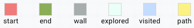
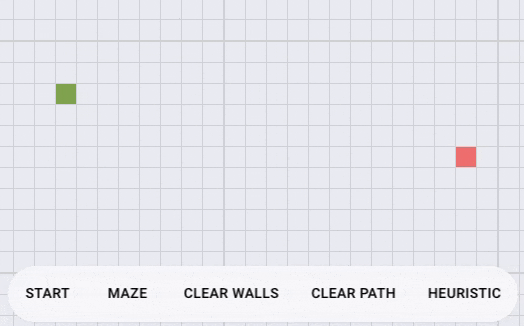
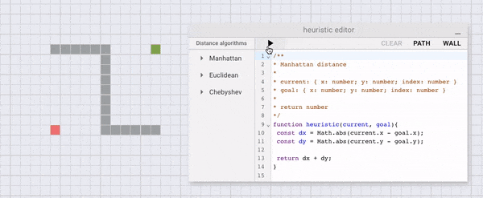

# A\* Visualizer

A\* pathfinding visualization web app made with React.

[DEMO](https://rnike.github.io/astar-visualizer)

## How to use the app



### Simple usage

1. Drag and move the start block and the end block around.
2. Click on the start button to start finding the path.
3. Paint on the grid to place or erase wall blocks.
4. Click on the clear button to clear all walls or all paths
5. Click on the heuristic button to open the heuristic editor. (See [Heuristic](#heuristic))



## The algorithm

### A\*

This project has implemented the A\* algorithm from the pseudocode described on Wikipedia, the pseudocode can be found at [src/algorithms/aStar.pseudo](src/algorithms/aStar.pseudo), and the TypeScript implementation can be found at [src/algorithms/aStar.ts](src/algorithms/aStar.ts).

### Maze generation

This project uses the depth-first search algorithm with recursive implementation to generate a maze, which is described as blow:

```
1. Given a current cell as a parameter
2. Mark the current cell as visited
3. While the current cell has any unvisited neighbour cells
    1. Choose one of the unvisited neighbours
    2. Remove the wall between the current cell and the chosen cell
    3. Invoke the routine recursively for a chosen cell
```

The TypeScript(JavaScript) implementation can be found at [src/algorithms/mazeGenerate.ts](src/algorithms/mazeGenerate.ts)

## Heuristic



This project provides a heuristic function editor, which is using JavaScript, by changing the return value of the function may help understand how heuristic affects the pathfinding algorithm.

## Articles

- [A\* search algorithm](https://en.wikipedia.org/wiki/A*_search_algorithm) - Wikipedia
- [Introduction to the A\* Algorithm](https://www.redblobgames.com/pathfinding/a-star/introduction.html) - Red Blob Games
- [Maze generate](https://en.wikipedia.org/wiki/Maze_generation_algorithm) - Wikipedia

## Host locally

```bash
$ git clone https://github.com/rnike/astar-visualizer.git
$ cd astar-visualizer
$ yarn && yarn start
```

## Contributing

This project is intended for studying the A\* algorithm, any kind of contributions are welcome, including forking this project, making pull requests, and reporting issues.

## License

- MIT
